### 1 测试环境

机器配置及拓扑结构如下表所示。注意，这里只使用了一个TiDB-Server节点。

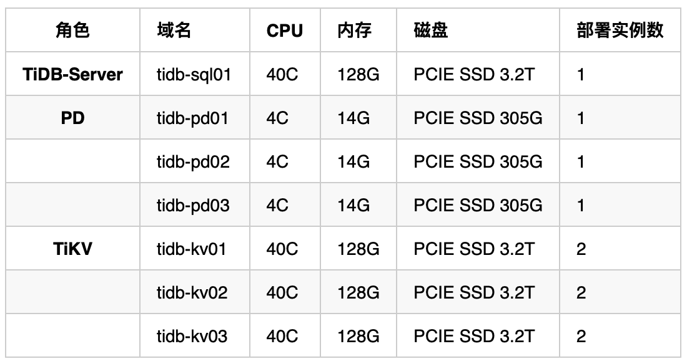

### 2 参数配置

注意，使用的是**TiDB3.0.5版本**。

#### 2.1 TiDB参数

使用的是**悲观事务模型**。

```plain
[pessimistic-txn]
enable = true
max-retry-count = 256
ttl = "30s"
[tikv-client]
commit-timeout = "41s"
grpc-connection-count = 16
grpc-keepalive-time = 10
grpc-keepalive-timeout = 3
[performance]
max-procs = 0
stats-lease = "3s"
stmt-count-limit = 5000
compatible-kill-query = false
host = "0.0.0.0"
lease = "45s"
mem-quota-query = 209715200
oom-action = "log"
socket = ""
store = "tikv"
token-limit = 10000
[log]
expensive-threshold = 10000
format = "console"
level = "info"
query-log-max-len = 30000
slow-threshold = 1000
```
#### 2.2 TiKV参数

由于一个物理机上部署了2个TiKV实例，因此在配置时，对线程数和storage容量进行了修改。

```plain
[readpool.storage]
high-concurrency = 12
low-concurrency = 12
max-tasks-per-worker-high = 24000
max-tasks-per-worker-low = 24000
max-tasks-per-worker-normal = 24000
normal-concurrency = 12
[readpool.coprocessor]
high-concurrency = 12
low-concurrency = 12
normal-concurrency = 12
[storage]
scheduler-concurrency = 2048000
[storage.block-cache]
capacity = "28GB"
[raftstore]
apply-pool-size = 2
capacity = "1400GB"
raft-base-tick-interval = "2s"
raft-log-gc-size-limit = "144MB"
raftdb-path = ""
store-pool-size = 2
[rocksdb.defaultcf]
dynamic-level-bytes = true
level0-file-num-compaction-trigger = 4
level0-slowdown-writes-trigger = 40
level0-stop-writes-trigger = 60
[rocksdb.defaultcf.titan]
[rocksdb.lockcf]
[rocksdb.writecf]
dynamic-level-bytes = true
level0-file-num-compaction-trigger = 4
level0-slowdown-writes-trigger = 40
level0-stop-writes-trigger = 60
```
### 3 sysbench测试

#### 3.1 测试过程

这里只测试索引更新（oltp_update_index）的场景。

```plain
# 创建database
create database sysbench_test;
# prepare (10张1百万行的表)
/usr/local/bin/sysbench --config-file=config_sysbench oltp_update_index --tables=10 --table-size=1000000 prepare
# run (可以多次运行，先预热buffer)
/usr/local/bin/sysbench --config-file=config_sysbench oltp_update_index --tables=10 --table-size=1000000 run
```
并发不同，每次运行2min，得到的QPS不同，总结如下表所示：

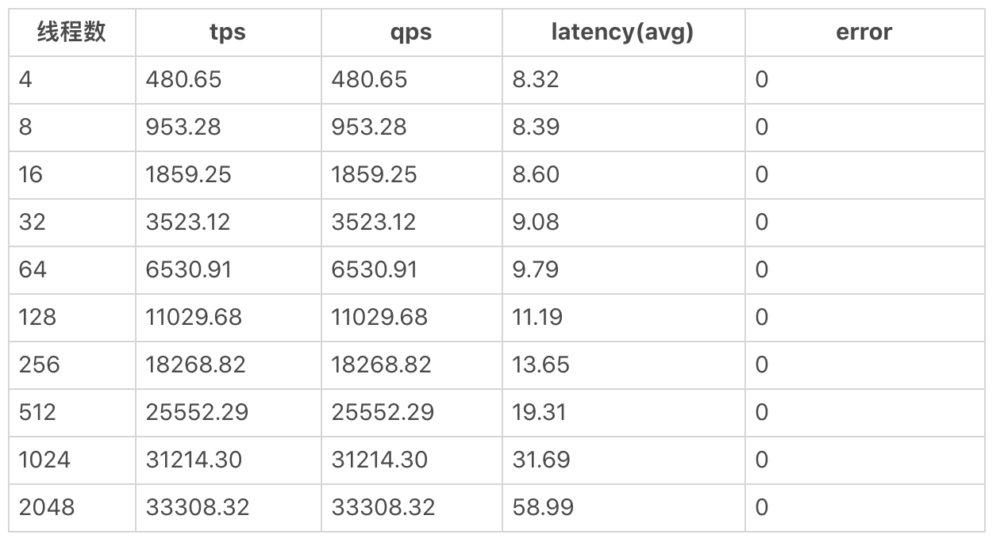

线程数与TPS的关系，以及 线程数与平均延迟的关系如下图：

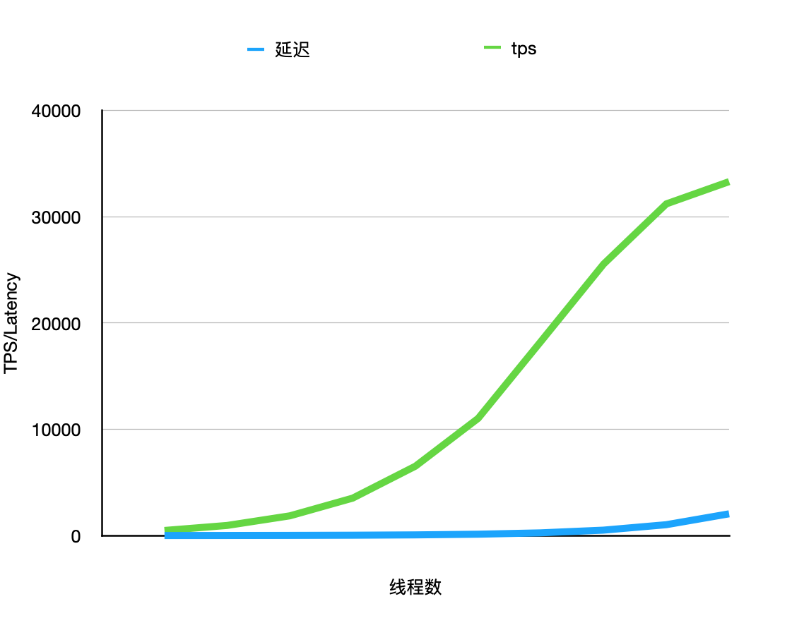

#### 3.2 监控指标


* TiDB:: Query Summary:: QPS/Duration

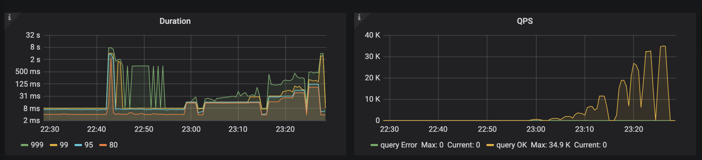


* TiKV::Cluster:: CPU/QPS

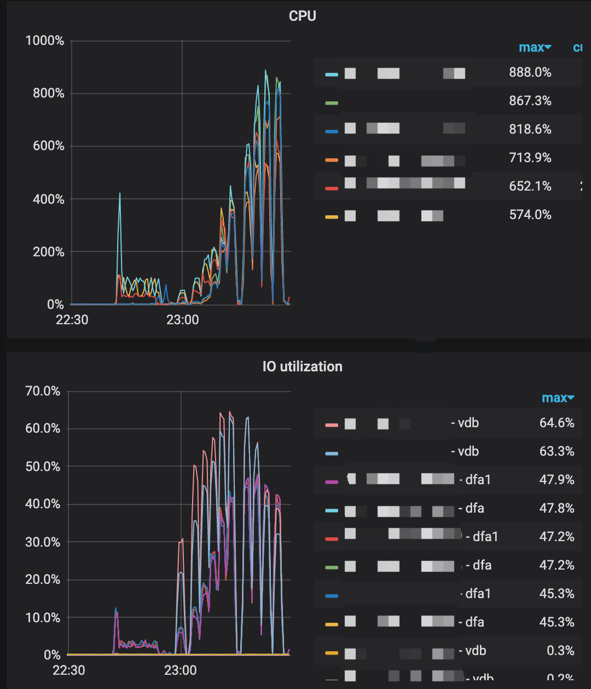


* TiKV:: gRPC:: QPS/Duration

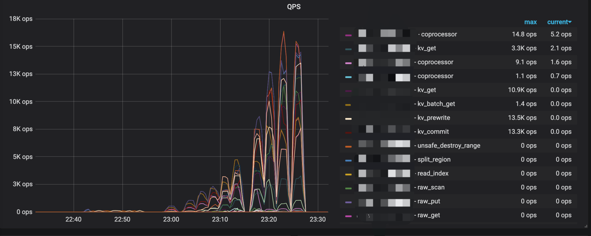

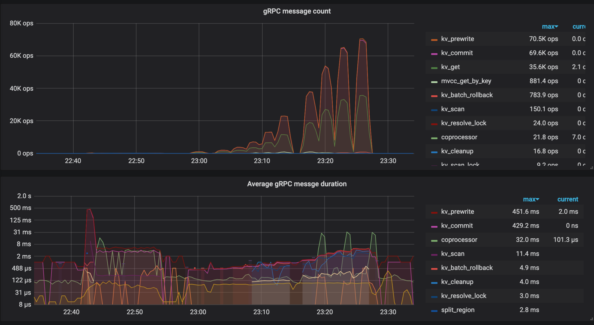

#### 3.3 结果分析


* 现象一

从上述测试结果看，512线程并发之前，大概并发线程数和TPS成线性增长关系；512并发后，随着线程数增加，TPS不再线性增长。

查看TiDB监控指标，可以看到，TiDB集群的并发冲突增多，从而可能导致出现上述问题。当然也不排除sysbench自身到达瓶颈，可以考虑多个sysbench并发压测。

下图中，便是512并发线程开始，**读写冲突和写写冲突慢慢加剧**。

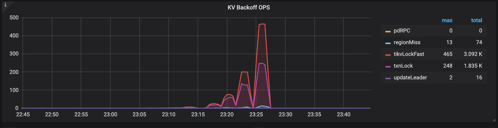


* 现象二

随着并发增加，512线程之前，延迟增长并不明显；512并发开始，明显感觉延迟增长比较激烈。

主要原因应该是，**并发冲突升高，冲突导致了SQL执行变慢**。

#### 3.4 性能分析

由于公司电脑没有开放dashboard的端口，所以无法使用dashboard的性能分析功能，因此只能手动调用TiDB的debug/zip服务来获取debug信息。

```plain
# 采样
curl -G http://{TiDBIP}:10080/debug/zip?seconds=30 > profile.zip
# 分析
go tool pprof profile
```

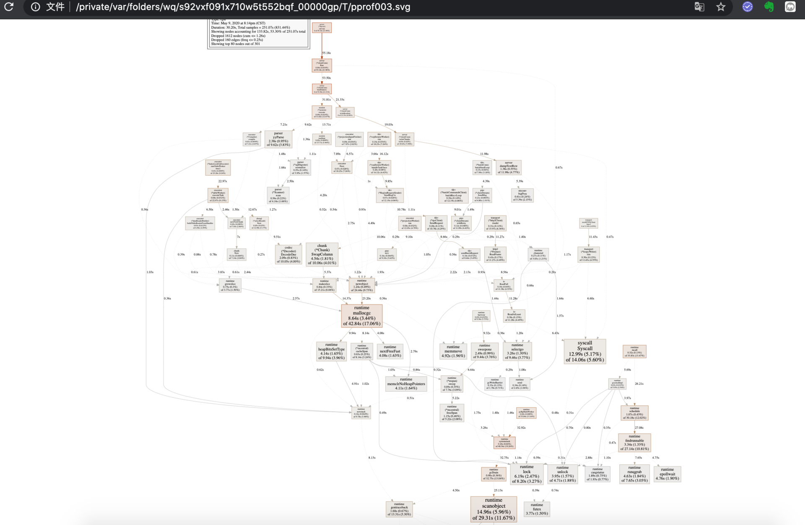

从生成的函数耗时上看，主要在如下两个函数耗时比较长。应该是隶属于**Executor（执行器）模块**。

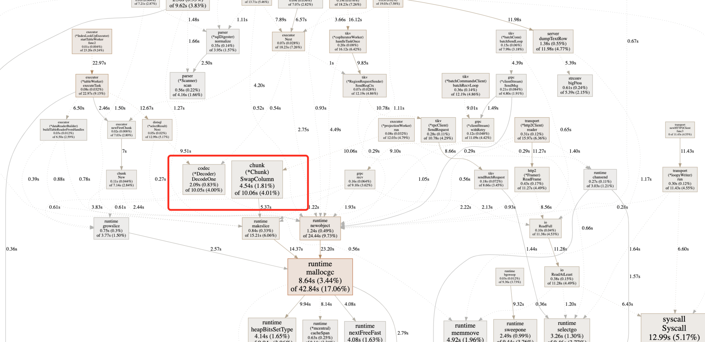

### 4 go-ycsb测试

#### 4.1 测试过程

```plain
## 下载安装
git clone https://github.com/pingcap/go-ycsb
cd go-ycsb
make
## load
./go-ycsb load mysql -P workloads/workloada -p recordcount=10000000 -p mysql.host=xxx.xxx.xxx -p mysql.port=4000 -p mysql.user="ght" -p mysql.password="123456" --threads 256
## run
./go-ycsb run mysql -P workloads/workloada -p operationcount=10000000 -p mysql.host=xxx.xxx.xxx -p mysql.port=4000 -p mysql.user="ght" -p mysql.password="123456" --threads 256
```
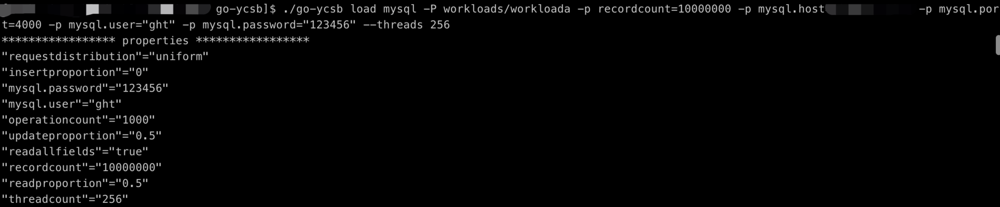

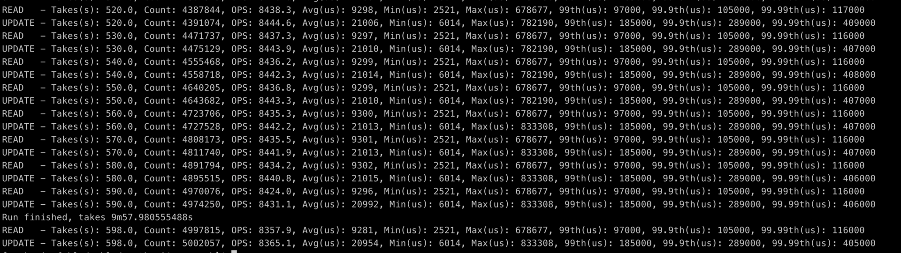

#### 4.2 监控指标

* TiDB:: Query Summary:: QPS/Duration

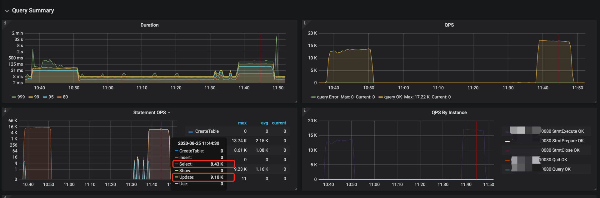

* TiKV::Cluster:: CPU/QPS

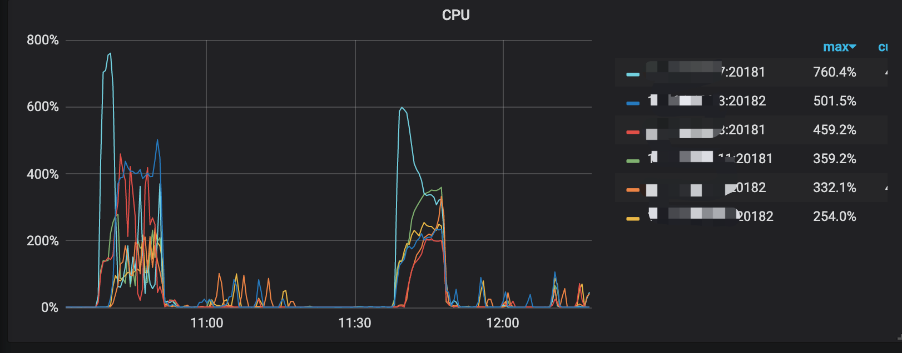

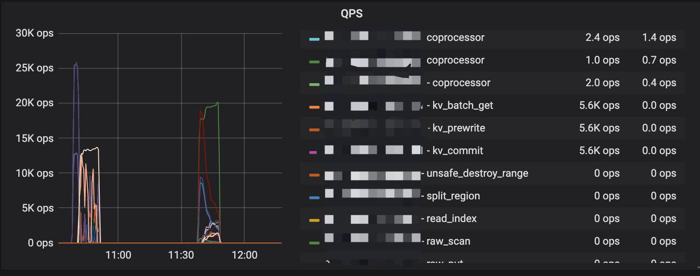

* TiKV:: gRPC:: QPS/Duration

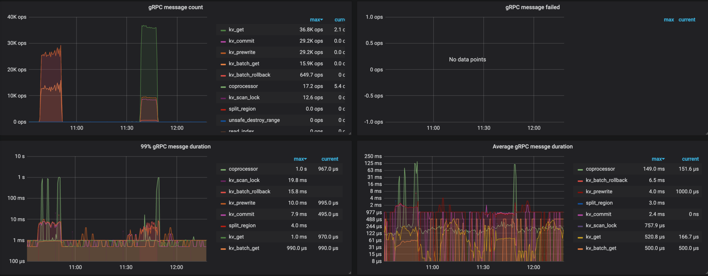

#### 4.3 结果分析

所运行的测试主要是 SELECT和UPDATE语句。运行过程中**读写/写写出现了一些冲突**，可能会造成延迟上涨。**这种冲突，一般只有业务方进行规避**。

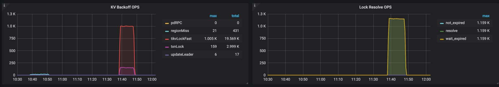

### 5 go-tpc测试

该测试可以测试TPCC和TPCH。由于上述测试主要是针对OLTP测试，因此该测试主要使用**TPCH，测试下TiDB的OLAP性能。**

#### 5.1 测试过程

```plain
## 安装
git clone https://github.com/pingcap/go-tpc.git
make build
## prepare
./go-tpc tpch -H xx.xx.xx.xx -P 4000 -U ght -p 123456 -D tpch_test --sf 100  prepare
## run
./go-tpc tpch -H xx.xx.xx.xx -P 4000 -U ght -p 123456 -D tpch_test --sf 100 run
```
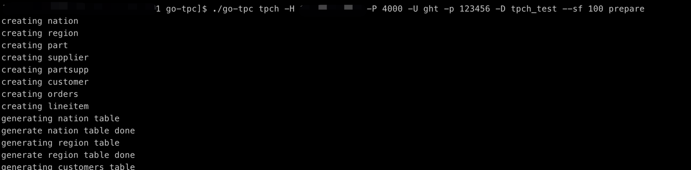

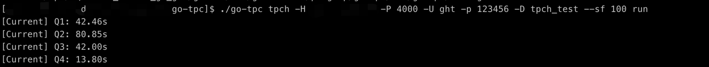

#### 5.2 监控指标

OLAP主要是比较消耗SQL节点的内存，通过监控查看，确实TiDB SQL节点内存消耗巨大。

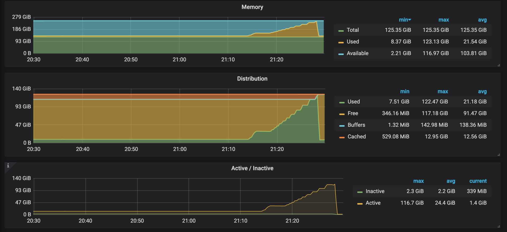

查看执行的SQL，大致如下，SQL比较复杂，但是几乎没有并发。

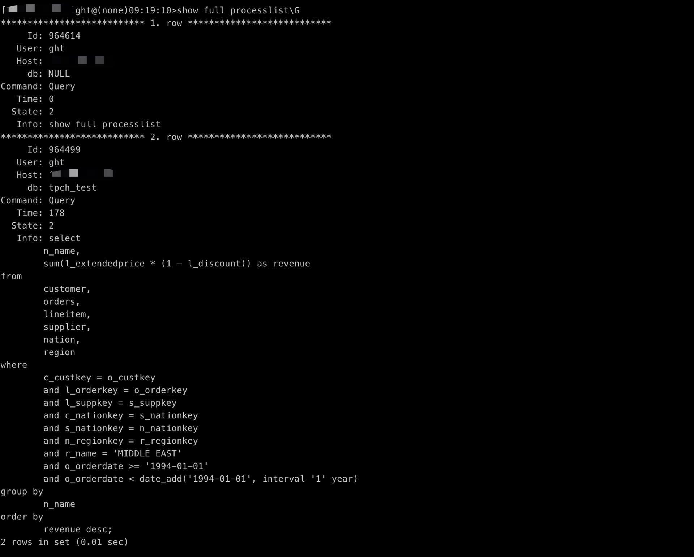

TiKV上，数据大多都在磁盘上，因此应该会有大量的I/O操作。查看监控，确实如此。

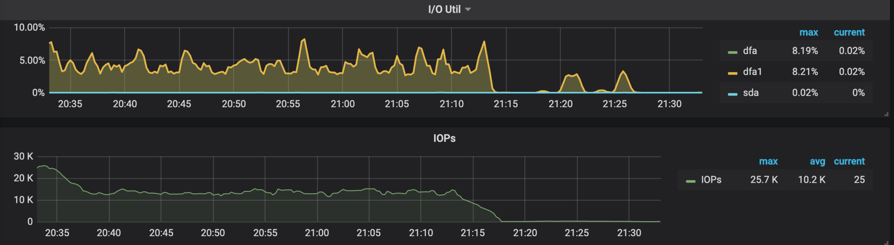

#### 5.3 结果分析

OLAP类型的SQL，会导致SQL节点内存消耗巨大；TiKV节点的I/O剧烈增加。

