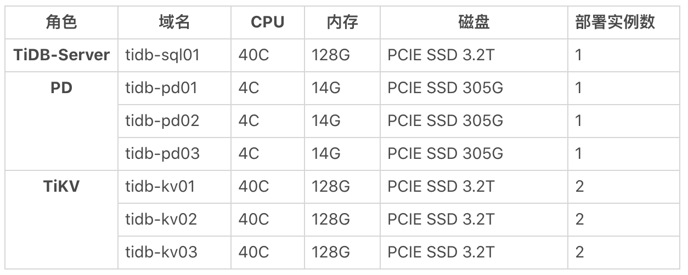
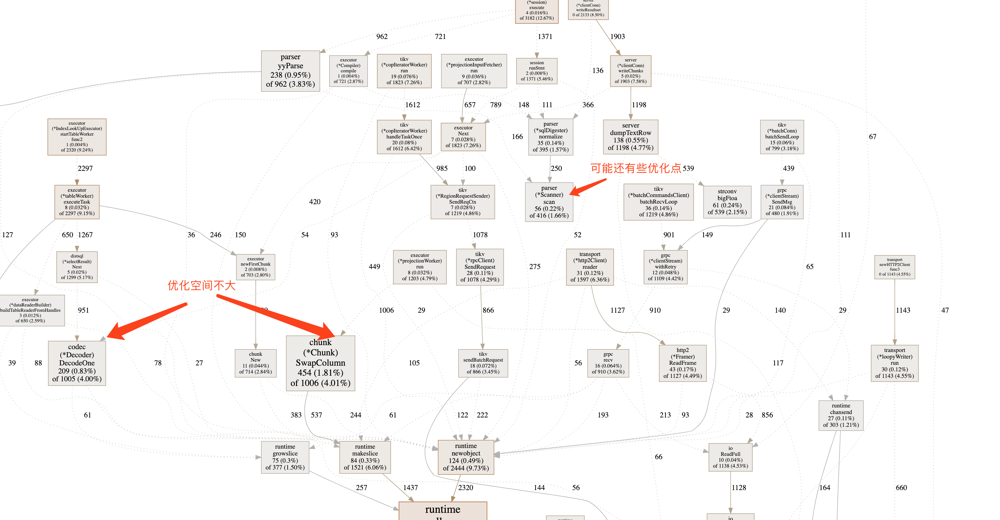

### 1 机器配置



### 2 workload情况

```plain
# prepare
/usr/local/bin/sysbench --config-file=config_br oltp_update_index --tables=1 --table-size=1000000 prepare
# run
/usr/local/bin/sysbench --config-file=config_br oltp_update_index --tables=1 --table-size=1000000 --mysql-ignore-errors=all run
```
### 3 profile情况

```plain
curl -G http://{TiDBIP}:10080/debug/zip?seconds=30 > profile.zip
go tool pprof -http=:8080 profile
```



### 4 优化建议

(*Scanner).scan 的逻辑可能会有些优化的地方。
[Issue](https://github.com/pingcap/tidb/issues/19687)

